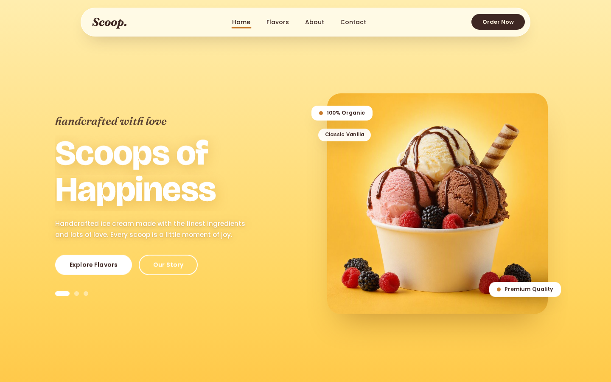

# Scoop. — Scoops of Happiness

A single-file, self-contained landing page for **Scoop.**, a handcrafted ice cream shop. Built as a 1:1 recreation of a modern design — bold editorial typography, warm cream-and-yellow palette, and playful animated hero.



## Features

- **Animated hero slideshow** — rotating flavor cups with word-wipe headline swaps, crossfading background tints, and synced subtitle transitions (GSAP)
- **Smooth scrolling** — Lenis-powered, integrated with GSAP ScrollTrigger
- **Scroll animations** — reveal-on-scroll headlines, staggered card batches, and depth-based parallax imagery
- **Fully self-contained** — all imagery is embedded as base64 data URIs, so there are zero external image requests
- **Responsive** — fluid layouts down to small screens
- **Accessible** — `prefers-reduced-motion` support disables animations; semantic markup with ARIA labels

## Sections

| Section | ID |
|---------|-----|
| Hero / flavor carousel | `#top` |
| Our Sweet Story | `#story` |
| Featured Flavors | `#flavors` |
| Order CTA | `#order` |
| Footer / contact & newsletter | `#contact` |

## Tech Stack

- Vanilla HTML + CSS (CSS custom properties for the design system)
- [GSAP 3](https://gsap.com) + ScrollTrigger
- [Lenis](https://github.com/darkroomengineering/lenis)
- Google Fonts: Bricolage Grotesque, Fraunces, Poppins

## Usage

No build step required. Open `scoop.html` in any modern browser:

```bash
open scoop.html   # macOS
xdg-open scoop.html  # Linux
```

## Structure

```
scoop/
├── scoop.html   # entire site: styles, markup, and scripts in one file
└── preview/     # hero section preview renders
```